# 🐾 Tailmate – Pet Adoption App (Flutter + Web)

**Tailmate** is a cross-platform Flutter application that helps users discover and adopt pets. It offers a clean, responsive UI for both mobile and web platforms, with features like pet listing, pet details, favorites, and image handling.  

---

## ✨ Features

- 🐾 **View a list of pets** with images, age, and price.
- ❤️ **Mark pets as favorite** for easy tracking.
- 📄 **View detailed information** about each pet with a clean UI.
- 🌐 **Responsive design** optimized for both mobile and web platforms.
- ⚙️ **Hosted API on Vercel** with mock JSON data for quick access.
- 🧩 **Smooth Hero animations** and custom card clipping for a polished feel.
- 🔐 **CORS-enabled API integration** to support Flutter Web.
- 💾 **Efficient caching** using Hive: pet data and images are stored locally to reduce API calls.
- 🔄 **Pull-to-refresh** feature to manually update data from the API.


---

## 📸 Screenshots

### 🏠 Home Page
| Light Mode | Dark Mode |
|------------|-----------|
| 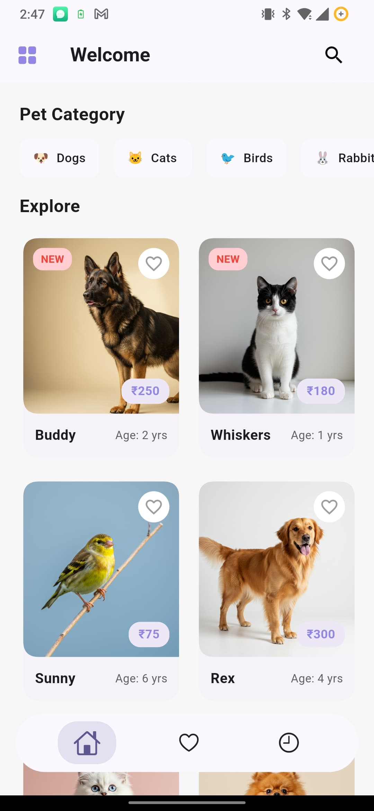 | 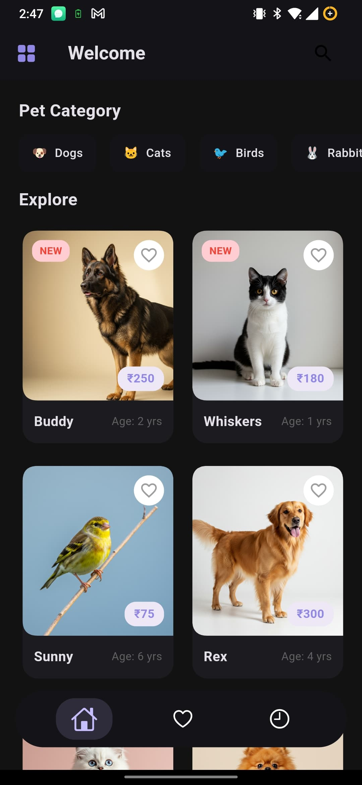 |

### 🏠 Home Page Category
| Light Mode                                                    | Dark Mode                                                   |
|---------------------------------------------------------------|-------------------------------------------------------------|
| 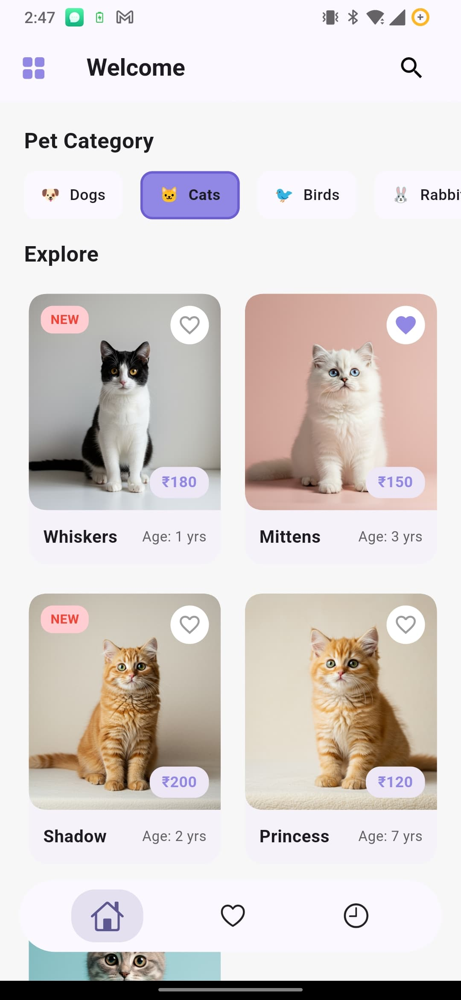 | 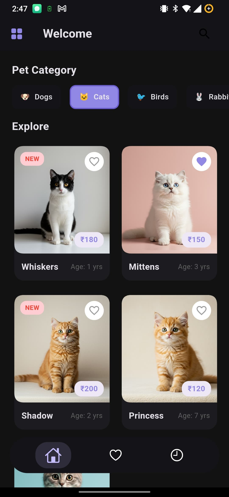 |

### 🔍 Search Page
| Light Mode | Dark Mode |
|------------|-----------|
| 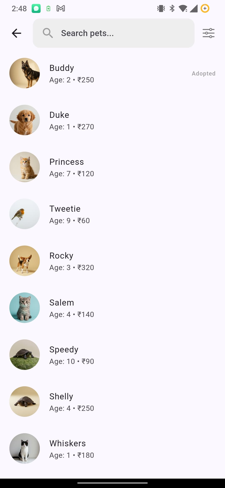 | 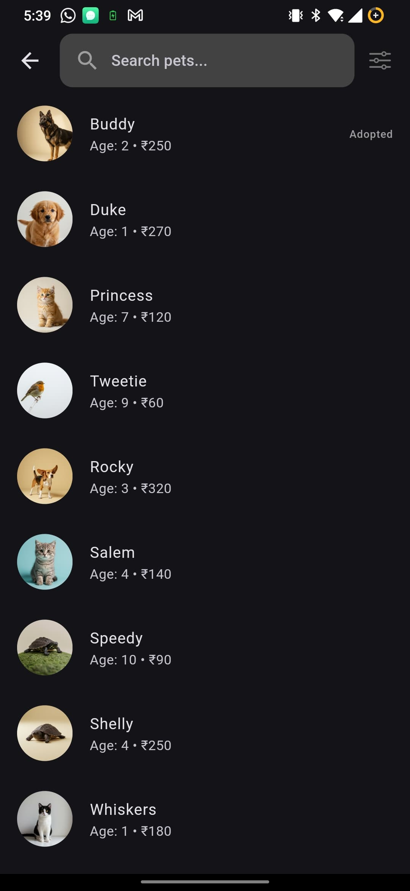 |

### 📋 Search Results Filter
| Light Mode                                                  | Dark Mode                                                 |
|-------------------------------------------------------------|-----------------------------------------------------------|
| 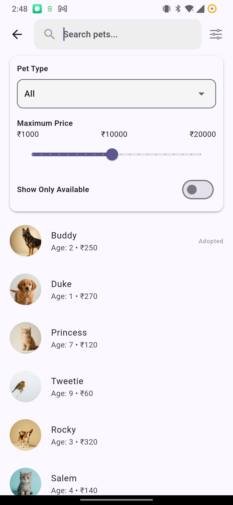 | 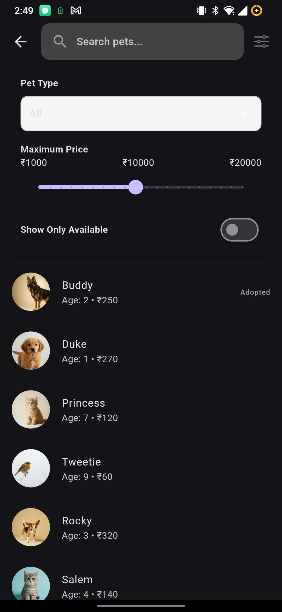 |

### 📋 Search Results
| Light Mode                                                                | Dark Mode |
|---------------------------------------------------------------------------|-----------|
| 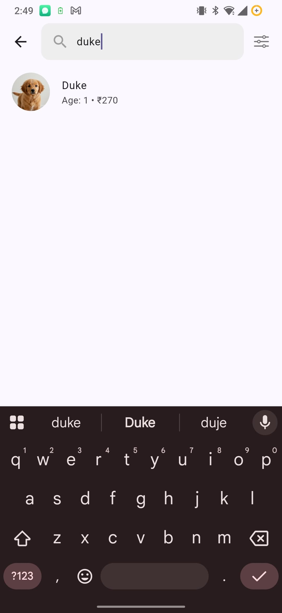 | 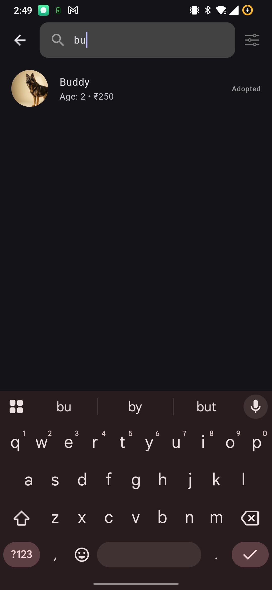 |

### 📂 Drawer
| Light Mode | Dark Mode |
|------------|-----------|
| 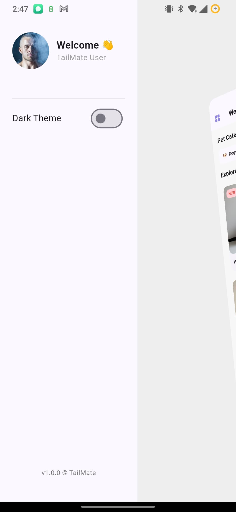 | 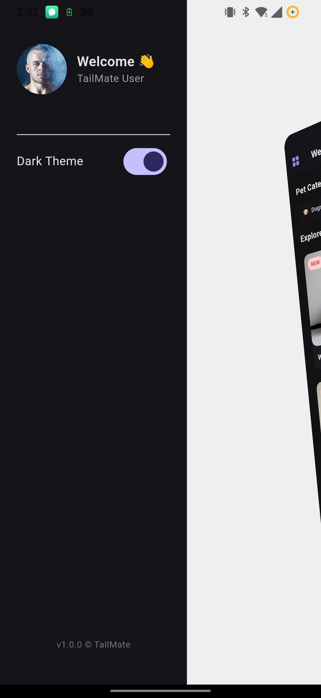 |

### ❤️ Favorites Page
| Light Mode | Dark Mode |
|------------|-----------|
| 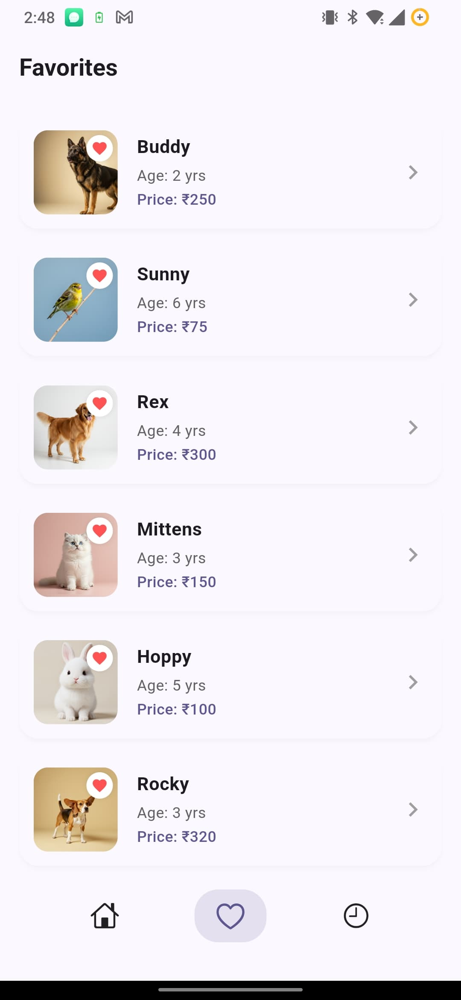 | 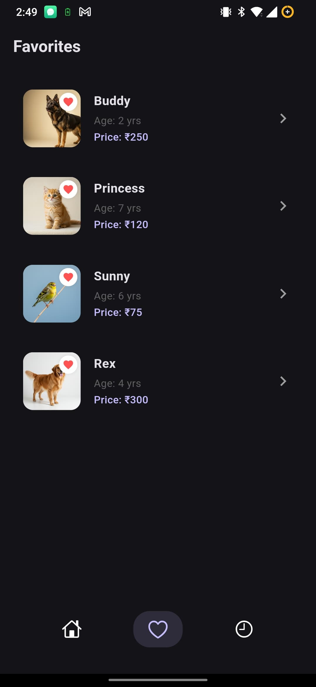 |

### 🕓 Filter History
| Light Mode | Dark Mode |
|------------|-----------|
| 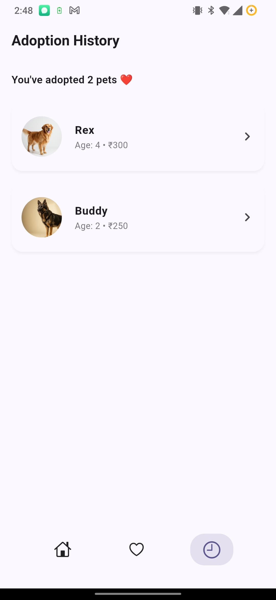 | 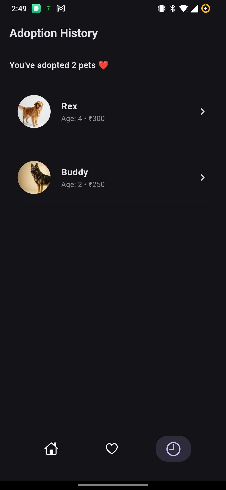 |

### 📄 Details Page
| Light Mode | Dark Mode |
|------------|-----------|
| 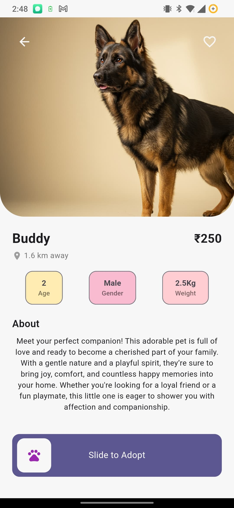 | 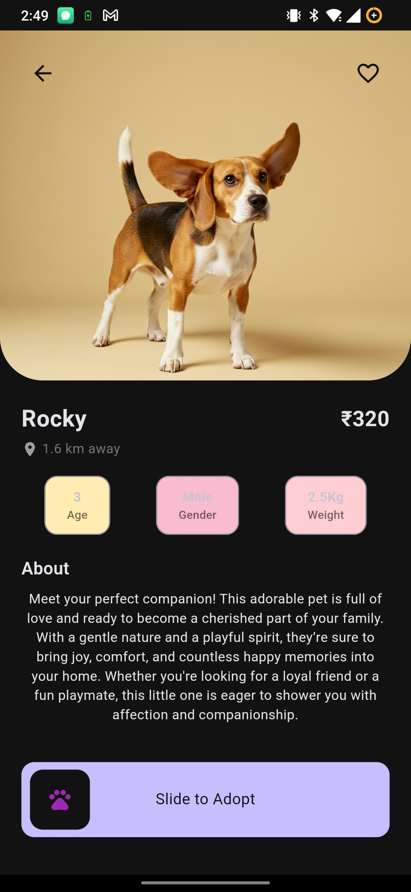 |

### 🎉 Adoption Success
| Light Mode | Dark Mode |
|------------|-----------|
| 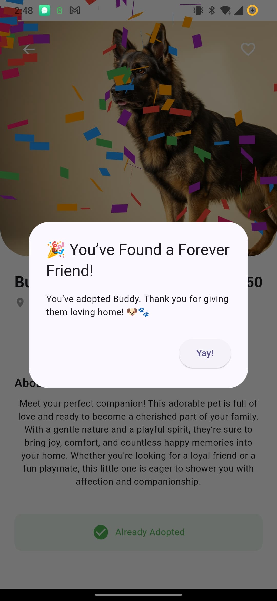 | 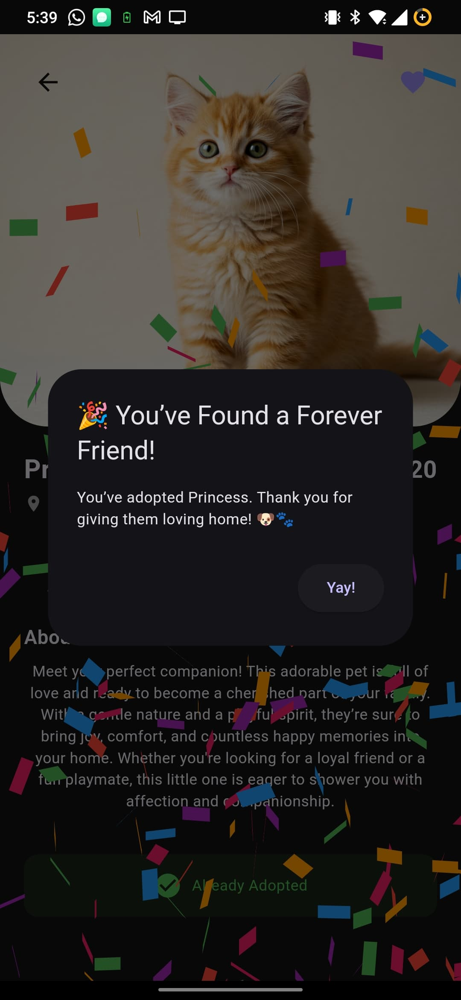 |


---

## 🌐 Live Web Demo

👉 **[Try the Web App](https://tailmate-web-azure.vercel.app/)** (Hosted on Vercel)

---

## 📦 APK & Code

- 🔗 **[GitHub Repository](https://github.com/TheScriptRailoth/tailmate)**
- 📱 **[Download APK](https://drive.google.com/file/d/1dbcDEWxoMB8SykIlPc1jo05hqMjRcjGJ/view?usp=sharing)**

---

## 🛠️ Tech Stack

- **Frontend:** Flutter (Dart)
- **Backend:** Node.js (Vercel Serverless Functions)
- **State Management:** `flutter_bloc`
- **Hosting:** Vercel (API & Web)
- **Storage:** JSON file-based mock data

---

## 🗂️ Folder Structure

```bash
    
tailmate/
│
├── lib/
│ ├── cubits/
│ ├── models/
│ ├── screens/
│ └── widgets/
├── build/web/ # Web output folder (for hosting)
├── api/ # Vercel serverless backend
├── data/pets.json # Mock pet data
├── pubspec.yaml
└── README.md
    
```
---

## 🧪 Run Locally

```bash
# Clone the repo
git clone https://github.com/yourusername/tailmate.git
cd tailmate

# Get dependencies
flutter pub get

# Run on Android
flutter run

# Run on Web
flutter run -d chrome

# Build for Web
flutter build web

```
----

## ☁️ Deployment Notes

- Only the build/web folder is deployed to Vercel due to the 100MB limit.
- Backend API is hosted via Vercel serverless functions inside /api.
- A vercel.json is used to route API requests properly.

---

## 🙏 Acknowledgements
Thanks to Posha for the opportunity and for providing the assessment prompt.
Built with ❤️ by Ashutosh Mishra.

---

## 📧 Contact

- 📧 Email: am3718440@gmail.com

- 🔗 LinkedIn: @thescriptrailoth

- 📱 Phone: +91-8423979654
